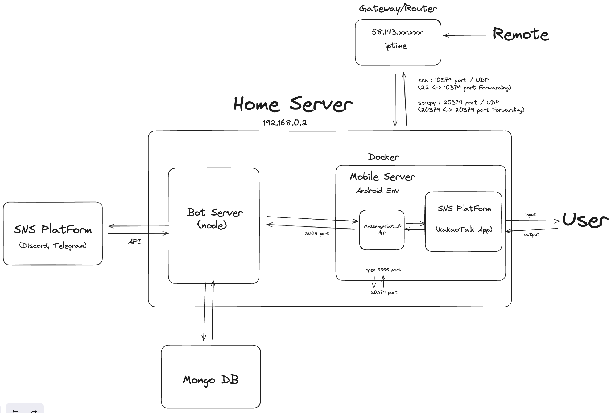

# 99-bot 소개

99-bot은 코인 및 NFT 관련 정보를 신속하게 제공하는 카카오톡 봇입니다. 최신 시세, 트렌드, 및 유용한 정보를 쉽게 얻을 수 있어 투자자들에게 가치 있는 툴로서의 역할을 합니다.

주식 시세, 환율, 코인 가격 등의 정보뿐만 아니라 공모주 일정, NFT 프로젝트 정보, 김치 프리미엄, 이더리움 가스 수수료 등 다양한 정보를 쉽게 확인할 수 있습니다.

또한, 99-bot은 각종 재미있는 기능도 제공합니다. GPT와 연동되어 있어 구구와 대화하거나, 한강 온도와 명언을 받아보거나, 랜덤 메뉴 추천부터 로또 번호 추첨까지 다양한 기능을 통해 사용자들에게 재미와 유용함을 제공합니다.

더불어, 99-bot은 특정 프로젝트에 대한 정보도 제공하여 해당 프로젝트를 이용하는 사용자들에게 프로젝트 모델에 대해 이해하고 참여할 수 있도록 돕습니다.

### 스택

- **언어:** 타입스크립트
- **데이터베이스:** 몽고디비
- **프레임워크:** NestJS

---

## 환경 세팅 가이드

### 패키지 설치 및 ENV 토큰값 설정

```bash
npm install
yarn insall

## .env 파일을 생성하여 해당 값 설정
## 포트값은 도커 포트와 맞추어줄 것

DISCORD_API_TOKEN = process.env.DISCORD_API_TOKEN
COINMARKETCAP_API_TOKEN = process.env.COINMARKETCAP_API_TOKEN
MONGODB_API_TOKEN = process.env.MONGODB_API_TOKEN
PAPAGO_SECRET_TOKEN = process.env.PAPAGO_SECRET_TOKEN
PAPAGO_ID_TOKEN = process.env.PAPAGO_ID_TOKEN
BIRDEYE_API_TOKEN = process.env.BIRDEYE_API_TOKEN


```

### 모바일 서버 구성

에뮬레이터 및 모바일 실물 휴대폰을 이용하여 안드로이드os환경을 구성한 후 메신저봇R 어플 설치를 히여 환경을 세팅합니다.
모바일 서버에서는 프로젝트의 remote-kakao 라이브러리를 이용하여 서버와의 통신을 담당하게 됩니다.
모바일 서버코드는 [remote-kaka client code github](https://github.com/remote-kakao/core-client) 내용을 확인해주세요.

### 서버 설정

서버 측에서는 remote-kakao 패키지를 통해 카카오톡 봇을 초기화하고, 필요한 기능들을 구현합니다.

### 실행 및 테스트

세팅이 완료되면 서버를 실행하고, 모바일 서버를 통해 메신저봇R 어플을 실행하여 카카오톡 메시지가 서버로 송수신이 잘 되는지 봇의 동작을 테스트합니다.

### 리드로이드를 이용한 환경 구성 권장

에뮬레이터를 이용한 환경 구성을 권장합니다. [리드로이드](https://github.com/remote-android/redroid-doc)는 안정적이며 다양한 설정이 가능하여 테스트 및 개발 시에 유용하게 활용할 수 있습니다.

이렇게 구성된 다중 SNS 브릿지 봇은 타입스크립트와 NestJS, 몽고디비를 기반으로 안정적이고 확장 가능한 아키텍처를 구축하여 다양한 프로젝트에 유연한 소통 경로를 제공합니다.
